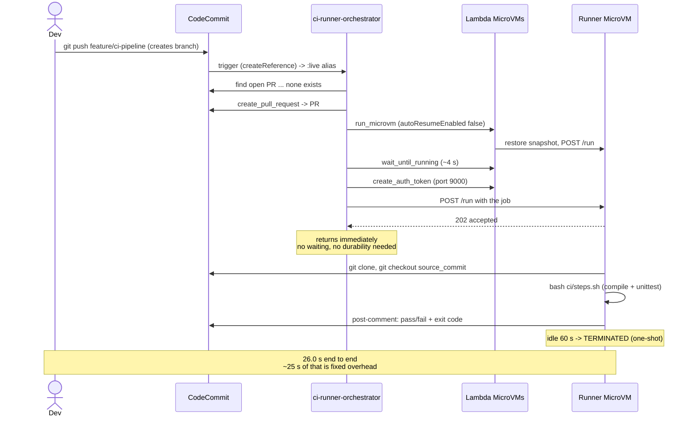

# Module 3 — Ephemeral CI runner

**Goal.** Every push gets a brand-new build machine that runs the repo's pipeline,
reports pass/fail on the pull request, and then ceases to exist.

**Why it matters.** Traditional CI runners are long-lived servers you patch, secure, and
pay for while idle. Worse, they accumulate state: a leftover `node_modules`, a poisoned
pip cache, a file written by a previous job. That is where "works on CI, fails locally"
comes from. A fresh MicroVM per push eliminates the whole category.

**Contrast with module 2.** Module 2 needed durable execution because it waited for a
result. Module 3 does **not wait at all** — the orchestrator dispatches the job and
exits. The runner is autonomous and reports for itself. Simpler, and cheaper.

---

## 1. Architecture

```
  git push (feature/ci-pipeline)
        |
        v
  CodeCommit --- trigger: createReference + updateReference ---> ci-runner-orchestrator:live
                                                                        |
   +--------------------------------------------------------------------+
   |  Plain Lambda (not durable), Timeout 120s                          |
   |    1 find open PR for branch ... or OPEN ONE                       |
   |    2 run_microvm (idle 60s, autoResume FALSE = one-shot)           |
   |    3 wait_until_running (max 60s)                                  |
   |    4 create_microvm_auth_token (port 9000)                         |
   |    5 POST /run  -> 202                                             |
   |    6 return. DONE. No waiting.                                     |
   +--------------------------------------------------------------------+
                                    |
                                    v
              +--------------------------------------------+
              |  Runner MicroVM (port 9000)                |
              |    202 accepted -> background thread       |
              |    git clone + git checkout <commit>       |
              |    bash ci/steps.sh   (from the repo!)     |
              |    post-comment-for-pull-request           |
              |    goes idle -> self-terminates            |
              +--------------------------------------------+
```

Nobody terminates the runner. Its idle policy does, which means a crashed or hung job
cannot leak a machine.

---

## 1b. Flow diagram



Timings from [../METRICS.md](../METRICS.md).

---

## 2. The files

| Path | Role |
|---|---|
| `runner/app.py` | the CI agent: accepts a job, runs the pipeline, comments |
| `runner/Dockerfile` | image with git, bash, AWS CLI |
| `runner/build-image.sh` | zip → S3 → `create-microvm-image` → wait |
| `orchestrator/lambda_function.py` | launches and dispatches to one runner per push |
| `orchestrator/template.yaml` | SAM template (plain function + `live` alias) |
| `orchestrator/deploy.sh` | `sam build` + `sam deploy` |
| `trigger/wire-codecommit.sh` | invoke permission + trigger (merged, not overwritten) |
| `trigger/prepare-pipeline.sh` | writes `ci/steps.sh`, `src/`, `tests/` to a branch |

---

## 3. Complete flow

```
  SETUP (once)                        PER PUSH (automatic)
  ------------                        --------------------
  1 runner/build-image.sh             A push to feature/ci-pipeline
      -> CI_RUNNER_IMAGE_ARN           |
  2 orchestrator/deploy.sh             v
      -> ci-runner-orchestrator:live  B trigger fires (create OR update)
  3 trigger/wire-codecommit.sh        C orchestrator: find PR, else OPEN one
      add-permission                  D launch one-shot runner MicroVM
      put-repository-triggers (merge) E wait RUNNING, mint token
      test-repository-triggers        F POST /run -> 202, orchestrator EXITS
  4 trigger/prepare-pipeline.sh       G runner: clone + checkout commit
  5 git commit && git push  --------> H runner: bash ci/steps.sh
                                      I runner: comment pass/fail on the PR
                                      J runner idles -> TERMINATED
```

---

## 4. Step 1 — build the runner image

```bash
cd module-3-ci-runner/runner && ./build-image.sh
```

Mechanically identical to module 2's build (zip → S3 → `create-microvm-image` → poll →
persist), with one difference worth noting:

```bash
# no --environment-variables here: the runner needs no model configuration
--resources '[{"minimumMemoryInMiB":2048}]'
--egress-network-connectors "...INTERNET_EGRESS"   # required: pip install during builds
```

`INTERNET_EGRESS` is not optional for a CI runner — pipelines fetch dependencies.

On success it persists the ARN under a **distinct** variable name so it cannot collide
with module 2's:

```bash
sudo tee /etc/profile.d/ci-runner-image.sh >/dev/null <<EOF
export CI_RUNNER_IMAGE_ARN="${IMAGE_ARN}"
EOF
```

### The runner Dockerfile

```dockerfile
FROM python:3.12-slim
RUN apt-get update && apt-get install -y git curl unzip bash \
    && rm -rf /var/lib/apt/lists/*
RUN curl -fsSL "https://awscli.amazonaws.com/awscli-exe-linux-aarch64.zip" -o awscliv2.zip \
    && unzip -q awscliv2.zip && ./aws/install && rm -rf awscliv2.zip aws/
RUN pip install --no-cache-dir 'boto3>=1.43.0'
WORKDIR /workspace
COPY app.py .
EXPOSE 9000
CMD ["python3", "app.py"]
```

`bash` is explicit because pipelines are `bash ci/steps.sh`, and `slim` images ship
`dash` as `/bin/sh`. The AWS CLI is present so the runner can post PR comments using
its execution role — no credentials in the image.

---

## 5. Step 2 — deploy the orchestrator

```bash
cd module-3-ci-runner/orchestrator && ./deploy.sh
```

```yaml
CiRunnerOrchestrator:
  Type: AWS::Serverless::Function
  Metadata:
    BuildMethod: python3.13
  Properties:
    Runtime: python3.13
    Timeout: 120           # only needs to launch + dispatch
    MemorySize: 256
    AutoPublishAlias: live
```

Compare with module 2: **no `DurableConfig`**, `Timeout` 120 s instead of 900, and 256 MB
instead of 512. The function does not wait for the build, so it needs neither durability
nor headroom. `AutoPublishAlias: live` is kept for the same reason — a stable trigger
target across deploys.

### What the orchestrator does

```python
def lambda_handler(event: dict, context) -> dict:
    record = event["Records"][0]
    if record.get("eventName") == "TriggerEventTest":
        return {"statusCode": 200, "body": "Trigger test event; no runner launched"}

    repo_name = record["eventSourceARN"].split(":")[-1]
    branch = record["codecommit"]["references"][0]["ref"].removeprefix("refs/heads/")
    source_commit = record["codecommit"]["references"][0]["commit"]

    pr = find_open_pr_for_branch(repo_name, branch)
    if not pr:
        pr = open_pull_request(repo_name, branch)      # module 3 opens its own PR
    if not pr:
        return {"statusCode": 200, "body": f"No PR for {repo_name}#{branch}, skipping"}
    ...
```

The `open_pull_request` fallback is the important difference from module 2. Module 3
uses its own branch with no pre-seeded PR, so it creates one — and does so
**race-safely**, because two pushes can arrive together:

```python
except Exception as e:
    # usually: no difference from destination yet, or a concurrent invocation won
    logger.info(f"create PR failed for {repo_name}#{branch}: {e}; re-checking")
    return find_open_pr_for_branch(repo_name, branch)
```

Launch parameters encode "one-shot":

```python
resp = microvms.run_microvm(
    imageIdentifier=IMAGE_ARN,
    imageVersion="1.0",
    ingressNetworkConnectors=[... "HTTP_INGRESS"],
    egressNetworkConnectors=[... "INTERNET_EGRESS"],
    executionRoleArn=EXECUTION_ROLE,
    idlePolicy={"maxIdleDurationSeconds": 60,
                "suspendedDurationSeconds": 60,
                "autoResumeEnabled": False},     # never wake it again
)
```

| Setting | Why |
|---|---|
| `maxIdleDurationSeconds: 60` | job finishes, machine goes away quickly |
| `autoResumeEnabled: False` | a **one-shot** VM; nothing should ever reuse it |
| `imageVersion="1.0"` | hardcoded — publish a `2.0` and you must update this |

Then it waits only for `RUNNING`, mints a token, dispatches, and returns:

```python
wait_until_running(microvm_id)              # plain loop, 60s cap
token = microvms.create_microvm_auth_token(
    microvmIdentifier=microvm_id, expirationInMinutes=60,
    allowedPorts=[{"port": 9000}])["authToken"]["X-aws-proxy-auth"]

dispatch_job(endpoint, token, {"repo_name": ..., "branch": ..., "pr_id": pr["pr_id"],
                               "source_commit": ..., "destination_commit": ...,
                               "region": REGION})
return {"statusCode": 202, ...}
```

`202` is the honest status: work accepted, not finished.

---

## 6. Step 3 — wire the trigger

```bash
cd module-3-ci-runner/trigger && ./wire-codecommit.sh
```

Same two-part structure as module 2 (`add-permission` + `put-repository-triggers`), with
two deliberate differences.

**A different statement id and trigger name**, so module 2's are untouched:

```bash
STATEMENT_ID="codecommit-ci-trigger"
TRIGGER_NAME="ci-runner-trigger"
BRANCH="feature/ci-pipeline"
```

**Both reference events**:

```json
{"name":"ci-runner-trigger",
 "destinationArn":"arn:aws:lambda:...:function:ci-runner-orchestrator:live",
 "branches":["feature/ci-pipeline"],
 "events":["createReference","updateReference"]}
```

| Event | Fires when |
|---|---|
| `createReference` | the branch is **created** — module 3's very first push |
| `updateReference` | commits land on an existing branch |

With only `updateReference`, the first push creates the branch and fires **nothing** —
a genuinely baffling "my pipeline never ran".

Because `put-repository-triggers` overwrites the whole set, the merge is essential:

```python
merged = [t for t in existing if t.get("name") != new["name"]] + [new]
```

Verify both modules coexist:

```bash
aws codecommit get-repository-triggers --repository-name lambda-mvm-workshop-code-review \
  --query 'triggers[].{name:name,branches:branches,events:events}'
```

```json
[{"name":"ai-review-trigger","branches":["feature/bad-code"],"events":["updateReference"]},
 {"name":"ci-runner-trigger","branches":["feature/ci-pipeline"],"events":["createReference","updateReference"]}]
```

Branch scoping is what keeps them independent: a push to one branch cannot trigger the
other module.

---

## 7. Steps 4–5 — fire the pipeline

```bash
./prepare-pipeline.sh
```

It clones, then creates the branch if needed:

```bash
git checkout "${BRANCH}" 2>/dev/null || git checkout -b "${BRANCH}"
```

and writes three files. The pipeline definition itself:

```bash
#!/usr/bin/env bash
set -e                                              # fail the build on first error

echo "== compile =="
python -m compileall -q src                         # syntax-check everything

echo "== test =="
python -m unittest discover -s tests -p 'test_*.py' # run the suite
```

| Part | Purpose |
|---|---|
| `set -e` | without it, a failing step is ignored and the build reports success |
| `compileall -q` | fast syntax gate before the slower tests; `-q` quiets per-file output |
| `discover -s tests` | search `tests/` for matching files |
| `-p 'test_*.py'` | the filename pattern to treat as tests |

Then you push:

```bash
cd /tmp/ci-demo
git add ci src tests
git commit -m "Add CI pipeline and calculator module"
git push origin feature/ci-pipeline
```

---

## 8. What happens inside the runner

```python
if self.path == "/run":            # EXACT match: this is the CI job endpoint
    ...
    self._json(202, {"status": "accepted"})
    threading.Thread(target=run_job, args=(job,), daemon=True).start()
    return

# Any other POST (MicroVM lifecycle hooks) - always 200.
self._json(200, {"status": "ok"})
```

This is the **safest hook pattern in the repository**, and worth copying. The lifecycle
`run` hook arrives at `/aws/lambda-microvms/runtime/v1/run`, which is *not* equal to
`/run`, so it falls through to the catch-all 200. A lifecycle hook can never accidentally
fail here — the mistake that killed module 1's VM is structurally impossible.

The job then checks out the **exact commit** that was pushed:

```bash
git clone <codecommit-url> <work>      # full clone: the build needs a working tree
git checkout <source_commit>           # not the branch tip — the precise commit
```

Checking out the commit rather than the branch means a later push cannot change what
this build is testing.

Pipeline discovery is convention-based, with a sane default:

```python
if os.path.exists(os.path.join(work, "ci", "steps.sh")):
    cmd = ["bash", "ci/steps.sh"]                  # repo defines its own pipeline
else:
    cmd = ["bash", "-c", "python -m compileall -q . && "
           "if [ -f requirements.txt ]; then pip install -q -r requirements.txt; fi"]

proc = subprocess.run(cmd, cwd=work, capture_output=True, text=True, timeout=600)
return {"passed": proc.returncode == 0, "exit_code": proc.returncode,
        "output": (proc.stdout + proc.stderr)[-4000:]}
```

| Choice | Reason |
|---|---|
| `ci/steps.sh` convention | the pipeline lives in the repo, not in platform config |
| fallback checks | a repo with no pipeline still gets a useful signal |
| `timeout=600` | a hung build cannot occupy the VM indefinitely |
| `[-4000:]` | keep the **tail**, where failures actually appear |
| `stdout + stderr` | interleaved, so context isn't lost |

Feedback goes where the developer is looking:

```bash
aws codecommit post-comment-for-pull-request \
  --pull-request-id <id> --repository-name <repo> \
  --before-commit-id <destination> --after-commit-id <source> --content <markdown>
```

---

## 9. Verified result

The orchestrator auto-opened PR #2 and the runner posted:

```
## CI build passed (exit code 0)

Ran on an ephemeral Lambda MicroVM runner, commit `5554a2a8e1`.

Build output (last 4000 chars):
== compile ==
== test ==
.
----------------------------------------------------------------------
Ran 1 test in 0.000s

OK
```

To see a failure path, break a test and push again — the same comment format reports
`CI build failed` with a non-zero exit code and the failing output.

---

## 10. Debugging

```bash
# did the orchestrator run?
aws logs tail /aws/lambda/ci-runner-orchestrator --since 5m --format short

# was a runner launched, and did it die?
aws lambda-microvms list-microvms
aws lambda-microvms get-microvm --microvm-identifier <id> --query '[state,stateReason]'

# what did the pipeline print inside the VM?
aws logs tail /aws/lambda-microvms/mvm-ci-runner --since 10m | strings | grep -a '=='

# did the result land?
aws codecommit get-comments-for-pull-request --pull-request-id 2
```

| Symptom | Cause |
|---|---|
| first push to a new branch fires nothing | `createReference` missing from `events` |
| module 2's trigger disappeared | a `put-repository-triggers` that overwrote instead of merging |
| `No PR for ...#<branch>, skipping` | PR could not be opened — often no diff vs `main` yet |
| runner launched, no comment ever | execution role lacks CodeCommit comment permission |
| build fails only on CI | missing `INTERNET_EGRESS`, so `pip install` cannot reach the network |
| new runner code has no effect | orchestrator hardcodes `imageVersion="1.0"` |

---

## 11. Security notes

This module **executes repository code**, which makes it a genuine supply-chain surface.
Anyone who can open a PR can run arbitrary commands in the runner.

- **Hardware isolation per job** is the main mitigation: no shared kernel, no reuse.
- **Keep the execution role tight.** The pipeline inherits it. Here it can comment on
  PRs and read the repo — it should not be able to deploy or touch production.
- **Never put deployment credentials on a runner** that builds untrusted branches.
- `autoResumeEnabled: False` is a security property, not just cost control — a
  compromised runner is destroyed rather than resurrected for the next job.
- Consider dropping `INTERNET_EGRESS` and using an internal mirror if you need to stop
  a malicious build from exfiltrating data.

**Next:** [MODULE-4.md](MODULE-4.md) — from one VM per *job* to one VM per *tenant*, plus
IAM-enforced data isolation.
