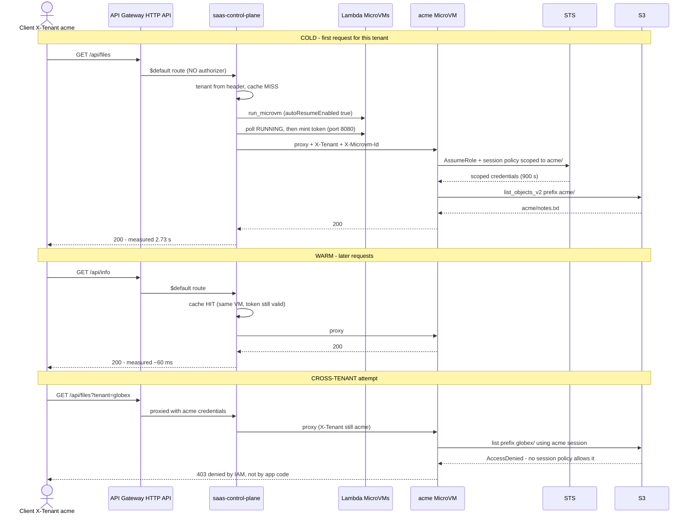

# Module 4 — Multi-tenant SaaS

**Goal.** A public HTTPS API where every tenant's requests are served by **that tenant's
own MicroVM**, and where each tenant can reach only its own data — enforced by IAM, not
by application `if` statements.

**The classic SaaS trade-off.** A *silo* (dedicated infrastructure per tenant) gives
strong isolation but costs a fortune and scales badly. A *pool* (shared compute) is cheap
but one bug in a `WHERE tenant_id = ?` leaks another customer's data. MicroVMs collapse
the trade-off: launch on demand, isolate at the hardware boundary, pay nothing between
requests.

---

## 1. Architecture

```
   client                          client
  (X-Tenant: acme)            (X-Tenant: globex)
        \                            /
         \                          /
          v                        v
      +----------------------------------+
      |  API Gateway HTTP API            |
      |  $default route (catch-all)      |
      |  ** NO AUTHORIZER **             |
      +----------------------------------+
                     |
                     v
      +----------------------------------+
      |  saas-control-plane (Lambda)     |
      |   resolve tenant from header     |
      |   _cache: tenant -> vm + token   |
      |   launch on first use            |
      |   mint token (port 8080)         |
      |   reverse-proxy the request      |
      +----------------------------------+
            |                     |
            v                     v
   +-----------------+   +------------------+
   | acme's MicroVM  |   | globex's MicroVM |
   |  app on :8080   |   |  app on :8080    |
   |  hooks on :9000 |   |  hooks on :9000  |
   +-----------------+   +------------------+
            |                     |
     sts:AssumeRole +      sts:AssumeRole +
     session policy        session policy
            |                     |
            v                     v
   s3://bucket/acme/*     s3://bucket/globex/*
        (denied           (denied globex ->
         acme -> globex)   acme)
```

Two isolation layers, and they are independent:

1. **Compute** — a separate VM per tenant, so a code-execution bug cannot cross tenants.
2. **Data** — per-request IAM session policies, so even *within* a VM the credentials
   cannot address another tenant's prefix.

---

## 1b. Flow diagram



Timings from [../METRICS.md](../METRICS.md).

---

## 2. The files

| Path | Role |
|---|---|
| `tenant-app/app.py` | the per-tenant app; assumes a scoped role per request |
| `tenant-app/Dockerfile` | tiny image: Python + boto3 |
| `tenant-app/build-image.sh` | zip → S3 → `create-microvm-image` → wait |
| `control-plane/lambda_function.py` | tenant router, VM cache, reverse proxy |
| `control-plane/template.yaml` | SAM template incl. the HTTP API |
| `control-plane/deploy.sh` | `sam build` + `sam deploy`, prints the URL |

---

## 3. Complete flow

```
  SETUP (once)                       PER REQUEST
  ------------                       -----------
  1 tenant-app/build-image.sh        A client sends X-Tenant: acme
      -> SAAS_IMAGE_ARN              |
  2 control-plane/deploy.sh          v
      -> API Gateway URL            B API Gateway -> control plane ($default)
                                    C tenant in _cache?
                                        no  -> launch VM, wait RUNNING
                                        yes -> reuse (auto-resumes if suspended)
                                    D token expiring? mint a new one (port 8080)
                                    E proxy request + X-Tenant + X-Microvm-Id
                                    F app: sts:AssumeRole with session policy
                                    G S3 call succeeds only inside acme/
                                    H response relayed back to the client
```

---

## 4. Step 1 — build the tenant image

```bash
cd module-4-saas/tenant-app && ./build-image.sh
```

Same shape as modules 2 and 3, with a smaller footprint:

```bash
--resources '[{"minimumMemoryInMiB":1024}]'   # 1 GB, vs 2 GB for the AI/CI images
```

The app only serves HTTP and calls STS/S3, so it does not need Node.js or a CLI. Result
is persisted as its own variable:

```bash
sudo tee /etc/profile.d/saas-image.sh >/dev/null <<EOF
export SAAS_IMAGE_ARN="${IMAGE_ARN}"
EOF
```

Three modules, three separate variables (`IMAGE_ARN`, `CI_RUNNER_IMAGE_ARN`,
`SAAS_IMAGE_ARN`) so nothing clobbers anything.

### Dockerfile

```dockerfile
FROM python:3.12-slim
RUN pip install --no-cache-dir boto3     # only dependency
WORKDIR /workspace
COPY app.py .
EXPOSE 8080 9000                         # app port and hooks port
CMD ["python3", "app.py"]
```

---

## 5. Step 2 — deploy the control plane

```bash
cd module-4-saas/control-plane && ./deploy.sh
```

```yaml
SaasControlPlane:
  Type: AWS::Serverless::Function
  Metadata:
    BuildMethod: python3.13
  Properties:
    Runtime: python3.13
    Timeout: 60          # must cover a cold tenant launch
    MemorySize: 256
    Environment:
      Variables:
        MVM_IMAGE_ARN: !Ref ImageArn
        MVM_EXECUTION_ROLE_ARN: !Ref MvmExecutionRoleArn
    Events:
      Proxy:
        Type: HttpApi    # $default catch-all: every method and path

Outputs:
  ControlPlaneUrl:
    Value: !GetAtt ServerlessHttpApi.ApiEndpoint
```

| Setting | Purpose |
|---|---|
| `Type: HttpApi` with no path | creates the `$default` route — **all** methods and paths reach the function, so the proxy can forward anything |
| `Timeout: 60` | a first request for a tenant must wait out the VM launch |
| `ServerlessHttpApi` | the implicit API resource SAM creates; referenced for the output URL |

The script finishes by printing the public URL:

```bash
aws cloudformation describe-stacks --stack-name saas-control-plane \
  --query "Stacks[0].Outputs[?OutputKey=='ControlPlaneUrl'].OutputValue" --output text
```

> **This route has no authorizer.** See [§9](#9-security-notes) before reusing any of it.

---

## 6. How the control plane works

### Resolve the tenant

```python
if path == "/health":
    return _response(200, json.dumps({"status": "ok"}))   # launches nothing

tenant = headers.get("x-tenant")
if not tenant:
    return _response(400, json.dumps({"error": "missing X-Tenant header"}))
```

`/health` is handled before any tenant logic so monitoring never spins up a VM.
Headers are lower-cased first because HTTP header names are case-insensitive and
API Gateway's payload format 2.0 does not normalise them for you.

### Cache, launch, and lock

```python
_cache = {}          # tenant -> {microvm_id, endpoint, token, token_expires}
_locks = {}          # tenant -> threading.Lock

def resolve_upstream(tenant):
    with _tenant_lock(tenant):                       # per-tenant, not global
        entry = _cache.get(tenant)
        if entry is None:
            microvm_id, endpoint = launch_tenant_vm(tenant)
            entry = {"microvm_id": microvm_id, "endpoint": endpoint,
                     "token": None, "token_expires": 0}
            _cache[tenant] = entry
        if not entry["token"] or time.time() > entry["token_expires"] - AUTH_REFRESH_SKEW_SEC:
            entry["token"], entry["token_expires"] = mint_token(entry["microvm_id"])
        return entry["microvm_id"], entry["endpoint"], entry["token"]
```

| Detail | Why |
|---|---|
| module-scope `_cache` | survives across invocations that reuse a warm Lambda environment |
| **per-tenant** lock | two concurrent first-requests for one tenant must not launch two VMs; meanwhile other tenants are never blocked |
| `AUTH_REFRESH_SKEW_SEC` (5 min) | refresh **before** expiry, so a request never dies on a token that expired mid-flight |

The cache is per-Lambda-instance, so a scaled-out control plane may launch more than one
VM for the same tenant. A production version would move this to DynamoDB.

### Launch parameters

```python
idlePolicy={"maxIdleDurationSeconds": 900,     # 15 min of quiet before suspending
            "suspendedDurationSeconds": 300,   # then 5 min suspended before dying
            "autoResumeEnabled": True}         # a request wakes it back up
```

The exact opposite of module 3's one-shot runner. Here the VM should **survive gaps
between requests**, which is what makes a warm tenant feel instant. Note the comment in
the source: *the control plane never terminates a MicroVM* — the idle policy owns the
lifetime, so no bookkeeping is needed and a crashed control plane leaks nothing.

### Reverse-proxy the request

```python
req = urllib.request.Request(
    url, method=method, data=body if body else None,
    headers={"X-aws-proxy-auth": token,
             "X-aws-proxy-port": str(TENANT_PORT),   # 8080 inside the VM
             "X-Tenant": tenant,                     # who this is
             "X-Microvm-Id": microvm_id})             # which VM served it
```

`X-Microvm-Id` is how the app knows its own VM id — recall the `run` hook payload does
**not** carry it (see [../TROUBLESHOOTING.md](../TROUBLESHOOTING.md)).

Failures invalidate the cache so the next request self-heals:

```python
except Exception as e:
    _cache.pop(tenant, None)      # drop it; next request relaunches
    return _response(502, json.dumps({"error": "tenant MicroVM unavailable"}))
```

That matters because a cached entry can point at a VM that already self-terminated.

---

## 7. Data isolation: the token vending machine

The most reusable idea in this workshop. **One** role and **one** policy template
isolate unlimited tenants, with no per-tenant IAM to create or clean up.

### Build a policy for this request

```python
def scoped_policy(bucket, tenant):
    return json.dumps({"Version": "2012-10-17", "Statement": [
        {"Effect": "Allow", "Action": ["s3:ListBucket"],
         "Resource": f"arn:aws:s3:::{bucket}",
         "Condition": {"StringLike": {"s3:prefix": [f"{tenant}/", f"{tenant}/*"]}}},
        {"Effect": "Allow", "Action": ["s3:GetObject","s3:PutObject","s3:DeleteObject"],
         "Resource": f"arn:aws:s3:::{bucket}/{tenant}/*"}]})
```

Two statements because S3 needs two different shapes: `ListBucket` acts on the **bucket**
and is narrowed with an `s3:prefix` condition, while object actions act on **keys** and
are narrowed by the resource path.

### Assume the role with that policy attached to the session

```python
creds = _sts.assume_role(
    RoleArn=_tenant_access_role_arn(),
    RoleSessionName=f"tenant-{tenant}"[:64],   # shows up in CloudTrail; 64-char cap
    Policy=scoped_policy(_bucket(), tenant),   # <-- the session policy
    DurationSeconds=900,                       # 15 min, the minimum
)["Credentials"]
```

| Parameter | Purpose |
|---|---|
| `RoleArn` | one shared role with **broad** bucket access |
| `Policy` | the session policy — an **upper bound** on this session |
| `RoleSessionName` | per-tenant audit trail in CloudTrail |
| `DurationSeconds` | short-lived credentials |

**Effective permissions are the intersection** of the role's policy and the session
policy. The role can reach the whole bucket; the session can only reach one prefix; the
result is one prefix. Even a bug in the app cannot widen it, because the credentials
themselves are incapable of more.

### Proving it

The app accepts an optional `?tenant=` to *aim* at a different prefix while keeping the
caller's scoped credentials:

```python
target = self._query().get("tenant", tenant)   # which prefix to try
s3 = scoped_s3(tenant)                          # credentials for the REAL tenant
resp = s3.list_objects_v2(Bucket=_bucket(), Prefix=f"{target}/")
```

Verified results:

```bash
$ curl -H "X-Tenant: acme" "$URL/api/files"
{"tenant":"acme","target_prefix":"acme/","keys":["acme/notes.txt"]}

$ curl -H "X-Tenant: acme" "$URL/api/files?tenant=globex"
{"tenant":"acme","target_prefix":"globex/","error":"AccessDenied",
 "message":"User: arn:aws:sts::...:assumed-role/TenantAccessRole-workshop/tenant-acme
            is not authorized to perform: s3:ListBucket ... because no session policy
            allows the s3:ListBucket action"}
```

Read that message carefully: **"no session policy allows"**. The denial comes from IAM,
not from application code. That is the property worth engineering for.

---

## 8. Verified behaviour

```bash
URL=<ControlPlaneUrl>

# health: no VM launched
curl -s "$URL/health"
# {"status": "ok"}

# two tenants -> two different MicroVMs
curl -s -H "X-Tenant: acme"   "$URL/api/info"   # "microvm": "microvm-78f934dd..."
curl -s -H "X-Tenant: globex" "$URL/api/info"   # "microvm": "microvm-ced70315..."

# warm reuse: same VM across requests
for i in 1 2 3; do curl -s -H "X-Tenant: acme" "$URL/api/info" | jq -r .microvm; done
# microvm-78f934dd...  (x3)

# write into your own prefix
curl -s -X PUT -H "X-Tenant: acme" --data-binary "hello" "$URL/api/files/from-workshop.txt"
# {"tenant":"acme","wrote":"acme/from-workshop.txt","bytes":5}

# no tenant -> 400
curl -s "$URL/api/info"
# {"error": "missing X-Tenant header"}
```

The first request for a tenant is slow (VM launch); later ones are fast. That is the
cost model working as intended — capacity created on demand, nothing paid between
requests.

---

## 9. Security notes

**The control plane is unauthenticated.** This is the one thing to fix before reusing
any of this. The `$default` route has no authorizer, and tenant identity comes from a
client-supplied header:

```bash
curl -H "X-Tenant: globex" "$URL/api/files"   # any caller, any tenant, no credentials
```

Anyone on the internet can impersonate any tenant. The template acknowledges it, and it
is fine for a lab, but the fix is not optional in production:

- Put a **JWT authorizer** (Cognito/OIDC) or a Lambda authorizer on the route.
- Derive the tenant from **verified token claims**, never from a raw request header.
- Keep the header as an *internal* hop only — the control plane should set it after
  authenticating, and the tenant app should trust it only because the VM is reachable
  solely through the proxy.

What is genuinely well built here, and worth keeping:

- **Data isolation is enforced by IAM**, so an application bug cannot cross tenants.
  Note this binds whatever tenant the header claims — it is only as strong as the
  identity feeding it, which is exactly why the authorizer matters.
- **Compute isolation is hardware-level**, one VM per tenant.
- **Credentials are short-lived** (900 s) and minted per request.
- **No per-tenant IAM sprawl**: one role, one template, unlimited tenants.
- **`RoleSessionName` carries the tenant**, so CloudTrail shows who did what.

Two further hardening steps: validate the tenant id against an allow-list before
interpolating it into a policy (a exotic value could produce a surprising ARN), and add
per-tenant rate limiting, since one tenant can currently launch VMs and burn quota for
everyone.

---

## 10. Debugging

```bash
# control plane logs: launches, errors, cache misses
aws logs tail /aws/lambda/saas-control-plane --since 10m --format short

# which tenant VMs exist right now?
aws lambda-microvms list-microvms --output json \
  | jq -r '.items[] | select(.imageArn|contains("saas-tenant")) | "\(.microvmId) \(.state)"'

# why did a tenant VM die?
aws lambda-microvms get-microvm --microvm-identifier <id> --query '[state,stateReason]'

# what did the tenant app log?
aws logs tail /aws/lambda-microvms/mvm-saas-tenant --since 10m | strings

# is the data actually laid out per tenant?
aws s3 ls s3://lambda-mvm-workshop-tenant-data-<account>/ --recursive
```

| Symptom | Cause |
|---|---|
| `502 tenant MicroVM unavailable` | VM self-terminated while cached, or launch timed out — retry; the cache self-heals |
| `400 missing X-Tenant header` | header absent or misspelled |
| `AccessDenied` on your **own** prefix | execution role cannot `sts:AssumeRole` the tenant role, or the bucket policy is wrong |
| first request times out | `Timeout: 60` too tight for a cold launch |
| different VM id on every request | Lambda scaled out; `_cache` is per-instance — expected, move to DynamoDB if it matters |
| tenant sees another's data | session policy not applied — check `Policy=` is passed to `assume_role` |

---

## 11. What to take away

| Pattern | Reuse it for |
|---|---|
| **Token vending machine** | any multi-tenant data access; the single most valuable idea here |
| **VM per tenant, launched on demand** | silo-grade isolation at pool-grade cost |
| **Idle policy owns lifetime** | no cleanup code, no leaked capacity if the control plane crashes |
| **Cache + per-key lock** | avoiding duplicate expensive initialisation under concurrency |
| **Refresh credentials before expiry** | any long-lived proxy holding short-lived tokens |

Back to the [README](../../README.md), or revisit
[MODULE-1.md](MODULE-1.md) · [MODULE-2.md](MODULE-2.md) · [MODULE-3.md](MODULE-3.md).
